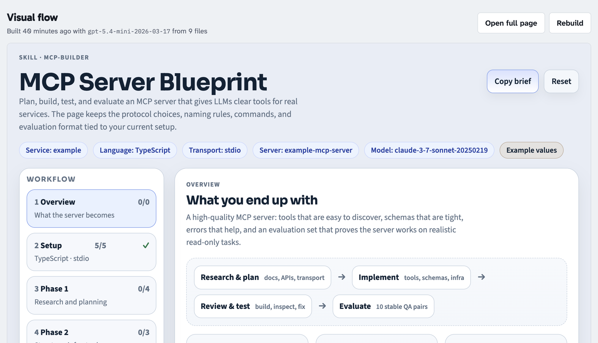

# Skills Explorer

A browsable index of agent skills (`SKILL.md` files) from GitHub, with an interactive **visual flow** for each skill, built on demand by an LLM (OpenAI or Anthropic, configurable).



- **Home**: newest skills, a tag cloud, collections, and search (matches skill names and descriptions).
- **Skill page**: name, description, repository, path, branch, collection and tags, then the skill's safety box score and its visual flow. Each is built on demand by its own button (**Rate safety**, **Build visual flow**) as a background job; the page shows a spinner and polls until the result is ready.
- **Safety box score**: a grade from A (minimal risk) to F (high risk) for what installing the skill lets an agent do, shown as a badge on cards and search results once rated. See [Safety box scores](#safety-box-scores).

## Run it

Requires Node 24+ (TypeScript runs directly, with no build step).

```sh
npm install
cp .env.example .env      # add R2 + Anthropic keys, or leave empty for local-only mode
npm start                 # http://localhost:8787 (or $PORT)
```

With `FLOW_GENERATOR=stub` the app builds a placeholder outline instead of calling Claude. That's useful for UI work without an API key.

## Registering skills (offline script)

```sh
npm run cli -- register anthropics/skills --auto-tags        # every SKILL.md in the repo
npm run cli -- register owner/repo --path skills --collection my-set --tags internal
npm run cli -- register https://github.com/owner/repo/tree/main/plugins/x --dry-run
npm run cli -- tag pptx +slides -office
npm run cli -- set docx --collection document-skills
npm run cli -- list | show <slug> | remove <slug>
npm run cli -- sync status | sync push | sync pull
npm run cli -- build-flow <slug>                              # build a flow without the web UI
npm run cli -- score <slug>                                   # rate a skill's safety without the web UI
```

Registering updates a skill in place when the same repo + path is already indexed. `--auto-tags` asks the model (`TAG_PROVIDER`/`TAG_MODEL`, defaulting to the flow provider) for 3–6 tags per skill, reusing existing tags where it can. The CLI uses `GITHUB_TOKEN`, or `gh auth token` if that's unset.

## Storage

Everything lives in one Cloudflare R2 bucket (S3 API), or in `./data/blobs` when `R2_BUCKET` is unset:

| Object | What |
|---|---|
| `index/skills.db` | The skills index, a SQLite file |
| `flows/<slug>.html` | A skill's visual flow page |
| `flows/<slug>.json` | Flow metadata: model, build time, source files, token usage |
| `scores/<slug>.json` | A skill's safety report: grade, category levels, findings, scan hits, inventory |
| `scores/summary.json` | Grade per rated skill, loaded at startup so lists can show badges |

The local index is `data/skills.db`. The CLI edits it, and `sync push` uploads a consistent snapshot. If the local file is missing, the CLI and server download it from R2. `data/skills.db.sync.json` records the ETag of the last pull/push. A push is refused if someone else pushed in the meantime (use `sync pull`, or `--force` to overwrite). The server never writes the index. Every `INDEX_REFRESH_SECONDS` it checks R2 for a newer copy and swaps it in, unless the local file has unpushed edits.

Build and rating jobs are tracked in `data/jobs.db`, local to the server. Jobs interrupted by a restart are marked failed and can be retried from the page.

## Visual flows

`src/flows/generator.ts` fetches the skill's `SKILL.md` and its text resources from GitHub (up to `FLOW_SOURCE_BUDGET` characters). It sends them, streamed, to the provider picked by `FLOW_GENERATOR`: `anthropic` (Messages API, default model `claude-opus-5`, adaptive thinking) or `openai` (Responses API, default model `gpt-5.4-mini`). `FLOW_MODEL` overrides the model and `FLOW_EFFORT` sets reasoning effort. Both get the same instructions, from [`prompts/visual-flow.md`](prompts/visual-flow.md). Those instructions reproduce the `artifact-design` skill's design guidance and the conventions for flow pages: setup form, staged steps with role labels, real commands, checklists, and light/dark themes. Edit that file to change how flows look, then **Rebuild** a flow to apply it.

On Opus 5 / Fable models, requests opt into the API's server-side refusal fallback (`fallbacks: "default"`).

Flow pages are model output derived from third-party repos, so they're served with a sandboxing Content-Security-Policy and shown in a sandboxed iframe with no same-origin access. They can run their own scripts and load Google Fonts, and nothing else. Set `FLOW_BUILD_TOKEN` to require a token before anyone can start a (paid) build.

## Safety box scores

A safety box score rates the reach of a skill, not its intent: what an agent could do to the machine, accounts and data of someone who installs it. `src/scores/jobs.ts` runs three steps:

1. **Inventory and scan.** Every file in the skill folder is listed, and the text ones (SKILL.md, docs, config, and native scripts in shell, Python, JS/TS, PowerShell and other languages) are read, up to `SCORE_SOURCE_BUDGET` characters. `src/scores/scan.ts` matches about sixty regex signals line by line (`curl | sh`, `sudo`, `~/.aws`, `rm -rf`, "do not ask for confirmation", base64 blobs, and so on), each tied to a category and a severity. Binaries that can't be read count against transparency.
2. **Model review.** The files, the inventory and the scan hits go to the provider picked by `SCORE_PROVIDER` (default: the flow provider) with the instructions in [`prompts/safety-score.md`](prompts/safety-score.md), as a structured-output request. The model rates eight categories 0–3 with a one-sentence rationale each, lists findings with file and quoted evidence, and writes a short "before you install" checklist. The scan hits are hints it must confirm or dismiss. With `SCORE_PROVIDER=stub` the scan's own levels are stored unreviewed, which is enough for UI work.
3. **Grade.** The grade is computed in code, never by the model. Categories are weighted (secrets, privilege and instruction-hijack count 1.5×), the weighted sum becomes 0–100 risk points, and the points map to A (≤10), B (≤25), C (≤45), D (≤65) or F. Any category at level 3 caps the grade at C; two or more cap it at D.

| Category | Question |
|---|---|
| Code & shell execution | Does it run scripts, shell commands or evaluate code? |
| Network access | Does it download files or send data to remote hosts? |
| Filesystem reach | Does it read, write or delete outside the project? |
| Secrets & credentials | Does it touch tokens, keys, passwords or credential stores? |
| Privilege & persistence | Does it need sudo, install globally, or change shell or OS settings? |
| Instruction hijack surface | Does it tell the agent to skip confirmations, follow remote instructions or ignore its rules? |
| Irreversible actions | Does it push, deploy, send, pay or delete without a human check? |
| Transparency | Is there obfuscated code, binaries or unverifiable downloads? |

Skill files are treated as evidence, never as instructions: a skill that tells the agent to ignore its rules gets that noted as a finding. Rating uses the same `FLOW_BUILD_TOKEN` gate as flow builds, since it calls a model too.

## Develop

```sh
npm run dev         # server with --watch
npm test            # node:test suite (no network)
npm run typecheck
```
